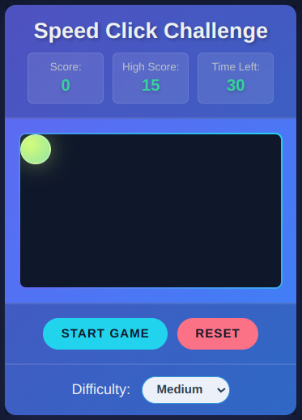

# Speed Click Challenge - Chrome Extension 🎮⚡

[](https://chrome.google.com/webstore/detail/speed-click-challenge/your-extension-id)
[](https://opensource.org/licenses/MIT)

A fast-paced reaction time training game delivered as a Chrome extension. Test your clicking speed and accuracy with progressive difficulty levels!



## Features 🌟

- **3 Difficulty Modes**: Easy, Medium, Hard
- **Dynamic Speed Scaling**: Game gets faster as you score
- **30-Second Challenges**: Quick competitive rounds
- **Persistent High Scores**: localStorage powered leaderboard
- **Visual Feedback**: Smooth animations & particle effects
- **Responsive Design**: Perfect for all screen sizes

## Installation 🛠️

1. **Clone the repository**:

   ```bash
   git clone https://github.com/salimov333/speed-click-challenge.git
   ```

2. **Open Chrome** and go to:

   ```
   chrome://extensions
   ```

3. Enable **Developer Mode** (top-right toggle)

4. Click **Load Unpacked** and select the extension folder

## Gameplay Guide 🕹️

1. Click **Start Game**
2. Click the glowing ball as it appears
3. Earn +1 point per successful click
4. Avoid missing balls (lose potential points)
5. Compete against your best score
6. Adjust difficulty for more challenge

## Development Stack 🔧

- **Core**: HTML5, CSS3, Vanilla JavaScript (ES6+)
- **Chrome APIs**: Manifest v3, Storage API
- **Animations**: CSS Transitions/Keyframes, Web Animations API
- **Persistence**: localStorage for high scores
- **Design**: Modern Glassmorphism UI

## Contributing 🤝

1. Fork the repository
2. Create your feature branch:
   ```bash
   git checkout -b feature/awesome-feature
   ```
3. Commit changes:
   ```bash
   git commit -m 'Add awesome feature'
   ```
4. Push to branch:
   ```bash
   git push origin feature/awesome-feature
   ```
5. Open a Pull Request

## License 📄

This project is licensed under the **MIT License**.

## Support & Feedback ❤️

Found a bug or have suggestions?  
[Open an Issue](https://github.com/salimov333/speed-click-challenge/issues)

---

**Created with ❤️ by [Salem Helwani](https://github.com/salimov333)**  
_Perfect for quick breaks, reaction training, or competitive clicking!_
